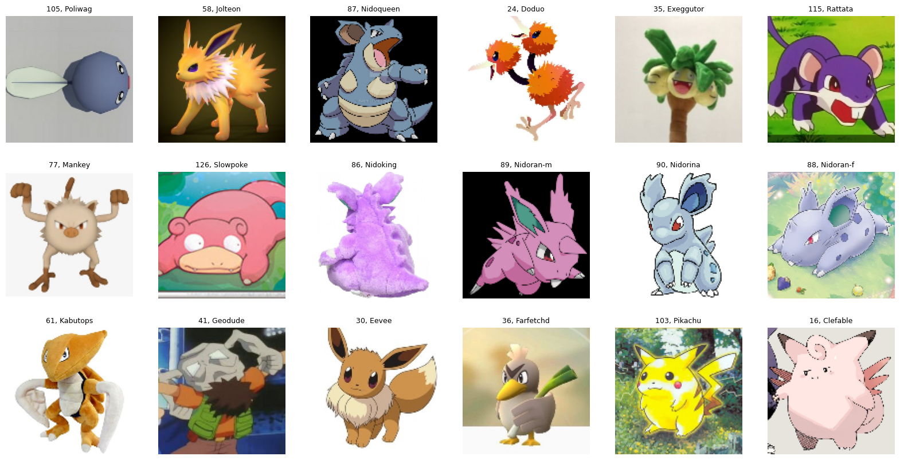
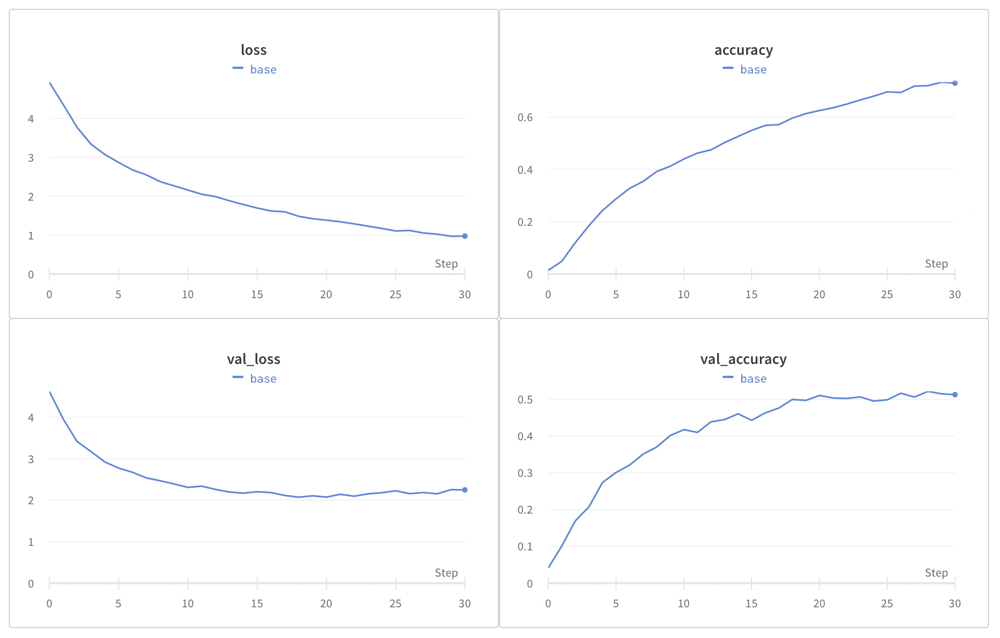
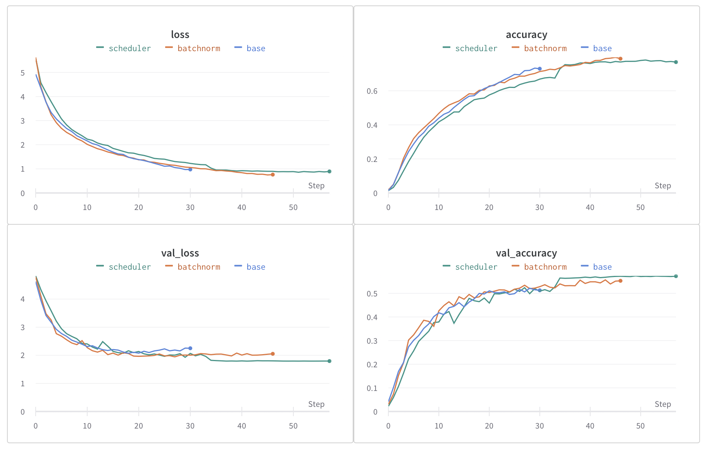
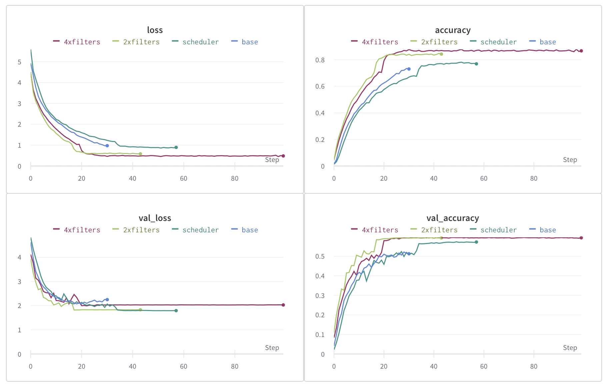
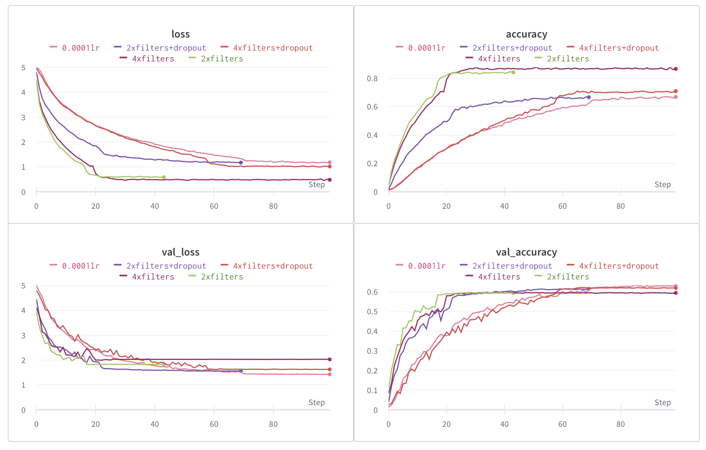
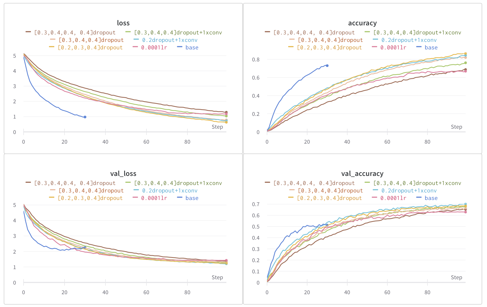

# Zadanie 2

Filip Petrán, Jakub Povinec 

- [github](https://github.com/ns-super-team/assignment-2)
- [wandb report](https://wandb.ai/ns-super-team/assignment-2/reports/Zadanie-2--Vmlldzo0MDQ3NDgy?accessToken=2agu4by2igv8jypslax6kcwqb48utc4h6ab8vko8wqu4q4286xgr0rs94q0njeex)

---

## Cieľ

Cieľom zadania bolo z dostupných obrazových dát (Pokémon dataset) natrénovať CNN klasifikátor, ktorý obrázky Pokémonov klasifikuje do jednej zo 151 tried.

## Dáta

Dataset je voľne dostupný na:

[https://www.kaggle.com/datasets/unexpectedscepticism/11945-pokemon-from-first-gen](https://www.kaggle.com/datasets/unexpectedscepticism/11945-pokemon-from-first-gen).

---

Dataset, s ktorým sme pracovali, obsahuje 151 rôznych tried, pričom každá trieda (Pokémon) má zastúpenie približne 60 - 100 obrázkov. Celková veľkosť datasetu je 11 945 obrázkov. Všetky obrázky v datasete majú rovnaký pomer strán a minimálne rozlíšenie 224x224. Všetky obrázkom sme dodatočne zmenili rozmery na 128x128 alebo 64x64.

**Vzorka dát**

Pôvodných **11 942** obrázkov sme si rozdelili na trénovaciu a validačnú množinu v pomere **7/3** **(8359**, **3583**). Dataset sme sa pokúsili ďalej rozšíriť pomocou jednoduchých augmentácií (náhodne rotácie, vertikálne a horizontálne otočenie).

## **Model**

Pri vytváraní modelu sme sa snažili, aby mali konvolučné vrstvy (extraktor príznakov) väčší počet trénovateľných parametrov ako časť s plne-prepojenými vrstvami (klasifikátor). Taktiež sme uprednostili šírku siete (väčší počet filtrov) pred hĺbkou, aby sme sa vyhli miznúcemu gradientu. 

Náš prvý model obsahoval 3 bloky tvorené konvolučnou vrstvou, aktivačnou funkciou ReLU a operáciou MaxPooling a následne 2 plne-prepojené vrstvy. V ďalších modeloch sme sa rozhodli zmeniť architektúru pridaním ďalšieho bloku. Taktiež sme do modelu pred aktivácie pridali batch normalizáciu a na zmenšovanie rozmeru obrázkov sme v sieti namiesto operácie MaxPooling použili konvolúcie so `stride=2` a `padding=1`.

V neskorších experimentoch sme ešte pridali do posledných dvoch blokov ďalšie konvolučné vrstvy a dropout. 

## Trénovanie

Model sme trénovali pomocou Adam optimalizátora s 0.001 a 0.0001 počiatočným lr, ktorý sme zmenšovali na plató. Velkosť batchov bola 256. Model sme trénovali do max 100 epoch, ale použili sme aj early stopping, ktorý tréning zastavil v prípade, že sa validačná chyba po 5 epochách nezlepšila. 

## Experimenty

Pri experimentovaní sme na vylepšenie úspešnosti modelu vyskúšali viaceré architektúry. Okrem rôznych architektúr sme tiež vyskúšali použiť viaceré metódy, ktoré by mohli vylepšiť výkonnosť modelu, ako napríklad batch normalizácia, learning rate scheduling alebo dropout.

### Prvý pokus

V prvej verzii sme vytvorili jednoduchý model, ktorý obsahoval iba 3 bloky tvorené jednou konvolučnou vrstvou, ReLU a MaxPoolingom, a následne 2 plne-prepojené vrstvy. Tento model ale nebol dobre vyvážený, pretože klasifikátor (plne-prepojené vrstvy) obsahoval výrazne viac parametrov oproti extraktoru príznakov. Model bol taktiež výrazne overfittnutý.

### Pridanie batch normalizácie a lr schedulera

Ako ďalšie sme do architektúry modelu vyskúšali pridať batch normalizáciu, čo čiastočne pomohlo, no model bol ešte stále overfittnutý. Taktiež sme si všimli, že sa validačný loss dostáva pomerne skoro na “plošinu” (plató), na čo sme v ďalšom pokuse použili scheduler (**ReduceLROnPlateau**), ktorý znižuje lr práve v prípade, keď sa sledovaná hodnota “zasekne”. Použitím schedulera sa nám podarilo ďalej vyzlepšiť úspešnosť nášho modelu.

### Zväčšenie extraktora

V predchádzajúcich pokusoch sme používali modely, ktoré mali príliš silný klasifikátor (zo všetkých 4,256,951 trénovatelných parametrov bolo práve 4,194,560 v plne-prepojených vrstvách). 

V tomto prípade sme **zdvoj/štvor**násobili počet filtrov, namiesto MaxPooling sme použili strided konvolúcie a taktiež sme do posledných dvoch blokov pridali ešte jednu konvolučnú vrstvu. Takto sme dostali architektúry, ktoré mali: 

- 1,441,911 trenovatelných parametrov, z čoho je 524,544 v klasifikátore pre obrázky 64x64
- 4,595,799 trenovatelných parametrov, z čoho je 1,048,832 v klasifikátore pre obrázky 64x64

Po vytvorení modelu, ktorý obsahoval väčší počet trénovateľných parametrov v extraktore príznakov sa nám podarilo zlepšiť úspešnosť modelu, no stále sme mali problem s overfittovaním.

### Regularizácia

Aby sme zabránili overfittovaniu nášho modelu, pridali sme ešte medzi jednotlivé bloky dropout, čo výrazne pomohlo. Taktiež sme sa rozhodli zmenšiť lr z pôvodných 0.001 na 0.0001, keďže sa nám z validačnej acc zdalo, že model osciluje. **Čo taktiež pomohlo.

### Dolaďovanie a finálny model

V tejto časti sme sa ešte snažili ďalej upraviť hyperparametre (hodnotu pravdepodobnosti dropoutu) a architektúru, aby sme dosiahli čo najlepšiu validačnú acc, ale zároveň najmenší overfit. Postupne sme pre dropout medzi konvolučnými vrstvami vyskúšali rôzne hodnoty, zatiaľ čo hodnotu dropoutu medzi plne-prepojenými vrstvami sme nemenili a používali sme stále 0.5. Taktiež sme menili počet konvolúcií v posledných dvoch blokoch. 

Náš najlepší model mal nastavené hodnoty dropoutu na 0.3, 0.3 a 0.4 po každom konvolučnom bloku a každý blok obsahoval jednu konvolúciu + strided konvolúciu. Klasifikátor obsahoval 2 plne-prepojené vrstvy, medzi ktorými bol dropout s hodnotou 0.5.

## **Zhodnotenie**

V tomto zadaní sme sa zaoberali klasifikáciou Pokémonov z voľne dostupného datasetu. Cieľom bolo vytvoriť model, ktorý dokáže klasifikovať Pokémonov do jednej z 151 tried. Postupne sme vyskúšali niekoľko verzií modelu, pričom sme prešli od jednoduchších architektúr ku komplexnejším.

Náš najlepší model dosiahol **validačnú accuracy 0.6826** a **validačný loss 1.281**.

Pri vyhodnocovaní úspešnosti modelu sme sa taktiež pozerali na také obrázky, ktoré náš model klasifikoval nesprávne a porovnali sme ich so zástupcom správnej triedy. Takto sme zistili, že model si najčastejšie mýlil evolúcie alebo pokémonov, ktorí majú rovnáke sfarbenie.

